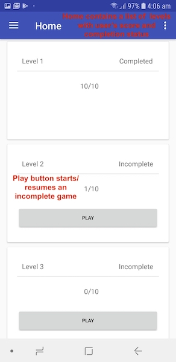

# FlashcardGame
The app supports gameplay regardless of whether the user has signed in or not. The user's progress is stored locally until the user signs in. Upon signing in, it provides sync functionalities so that the user's progress is also saved to a cloud database to allow the user to login and play from different devices via internet. MongoDB has been used as a database both for a local storage and cloud storage, using a serverless platform named MongoDB Stitch that provides features to manage syncronisation of data between local and cloud database. It is to be noted that the app is functional and game can be played at any point in time regardless of internet connectivity and user's login status. The app automatically syncs to the cloudDB when it receives internet connectivity. 

IMPORTANT NOTE:   

On successful sign in, user is prompted whether to sync data FROM or TO to the email. Both have been described below:
1. Sync Data <b>FROM</b> email- This will fetch the user's progress from the cloudDB and overwrite user's progress in localDB. For instance, a user logs in from device A and achieves a score of 3 in Level 1. Later, he logs in from device B and continues the game to reach a score of 5. Now, he again logs in from device A, (who until now had a score of 3) and wishes to sync progress to his device. In this case he may choose the FROM option. 

2. Sync Data <b>TO</b> email- This will fetch the user's progress from the localDB and overwrite user's progress in cloudDB. For instance, a user chooses to play as guest initially in a device and scores a whopping 8. He may now wish to sign in and also assign this progress to his account. In this case, he may choose the TO option.

Also, the apk may not run on an intel x86 emulator or device, as mongo SDK is compatible with only ARM devices. Therefore, it is recommended that you test the app on a physical device since most of them have ARM architecture.
 
 
 

Also, major changes introduced in MongoDB Stitch Android SDK versions 4.2.1 were async processing with callack mechanism over syncronised execution of certain SyncImpl. This led to changes in certain processes that sync data from remoteDB to localDB (however, viceversa worked fine) and some code clutter in LoginActivity(of course). It probably contains a bug as it kept reporting internal SDK error and for the same I have raised an issue in "stitch-android-sdk" repository <a href="https://github.com/mongodb/stitch-android-sdk/issues/171" target="_blank">(Click Here)</a>
 
 
 

 
 
 
The screens below are arranged in a manner to help comprehend the flow of the app.
 
   
 

  
The HomeScreen contains the list of levels along with user's scores and completion status. Clicking on Play Button starts/resumes an incomplete test.
   
 

  
As shown in the image, numbers depict the following:
1. Question status - [New] - [Learning, Reviewing, Checking] - [Revision]
2. Question Area
3. Answer Area (Types - radio buttons/checkboxes/text-input)
4. Submit Answer and Proceed

 
 

A question of single answer type

 
 

A question of multiple answers type

 
 

A question of text answer type

 
 
 

Sign in from nav bar

 
 
 

On successful sign in, user is prompted whether to sync data FROM or TO to the email. Both have been described below:
1. Sync Data <b>FROM</b> email- This will fetch the user's progress from the cloudDB and overwrite user's progress in localDB. For instance, a user logs in from device A and achieves a score of 3 in Level 1. Later, he logs in from device B and continues the game to reach a score of 5. Now, he again logs in from device A, (who until now had a score of 3) and wishes to sync progress to his device. In this case he may choose the FROM option. 

2. Sync Data <b>TO</b> email- This will fetch the user's progress from the localDB and overwrite user's progress in cloudDB. For instance, a user chooses to play as guest initially in a device and scores a whopping 8. He may now wish to sign in and also assign this progress to his account. In this case, he may choose the TO option.

 
 
 

Once the user signs out, he is again assigned a guestId while his progress is still maintained. In this case, he may wish to play as a guest and later on signIn by either forfeiting any progress by choosing sync FROM email option or may sync progress by choosing sync TO email option.

